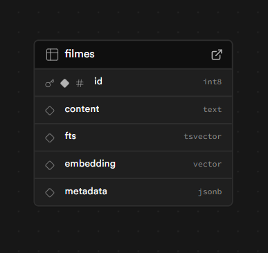

# 🎬 MovieRecommender  
Sistema de Recomendação de Filmes por Similaridade Semântica

---

## 📝 Descrição do problema
Muitas pessoas procuram filmes com base em descrições como “quero um filme policial sombrio”, “um romance leve”, ou “algo parecido com Inception”.  
Porém, sistemas tradicionais de recomendação dependem apenas de gênero, notas ou palavras exatas, o que limita bastante a precisão.

O **MovieRecommender** resolve isso usando **embeddings semânticos** e **banco de dados vetorial**, identificando filmes semelhantes pelo significado da sinopse, não pelas palavras.

Assim, o usuário descreve o tipo de filme que quer, e o sistema retorna as 5 obras mais similares.

---

## 🛠 Tecnologias usadas
- **Supabase (PostgreSQL + pgvector)**  
  Banco vetorial para armazenar embeddings dos filmes  
- **OpenAI Embeddings — texto-embedding-3-small (gratuito)**  
  Conversão da sinopse para vetor  
- **n8n Cloud (Free Trial)**  
  Workflow automatizado (Webhook → Embedding → Busca → Resposta)  
- **cURL / Postman**  
  Para testar o webhook  

---

## 🖼️ Capturas de Tela

### 📌 Estrutura de Dados – Supabase  

### 📌 Fluxo no n8n – Overflow  

---

## 🎥 Vídeo Demonstrativo

**Adicione aqui seu link do YouTube após gravar o vídeo demonstrativo:**

👉 https://youtu.be/WTCA7Cw_1D4
